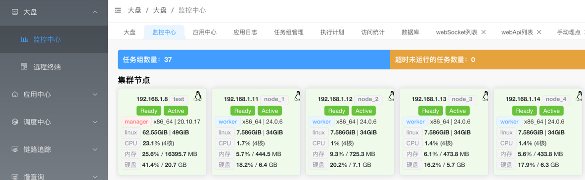
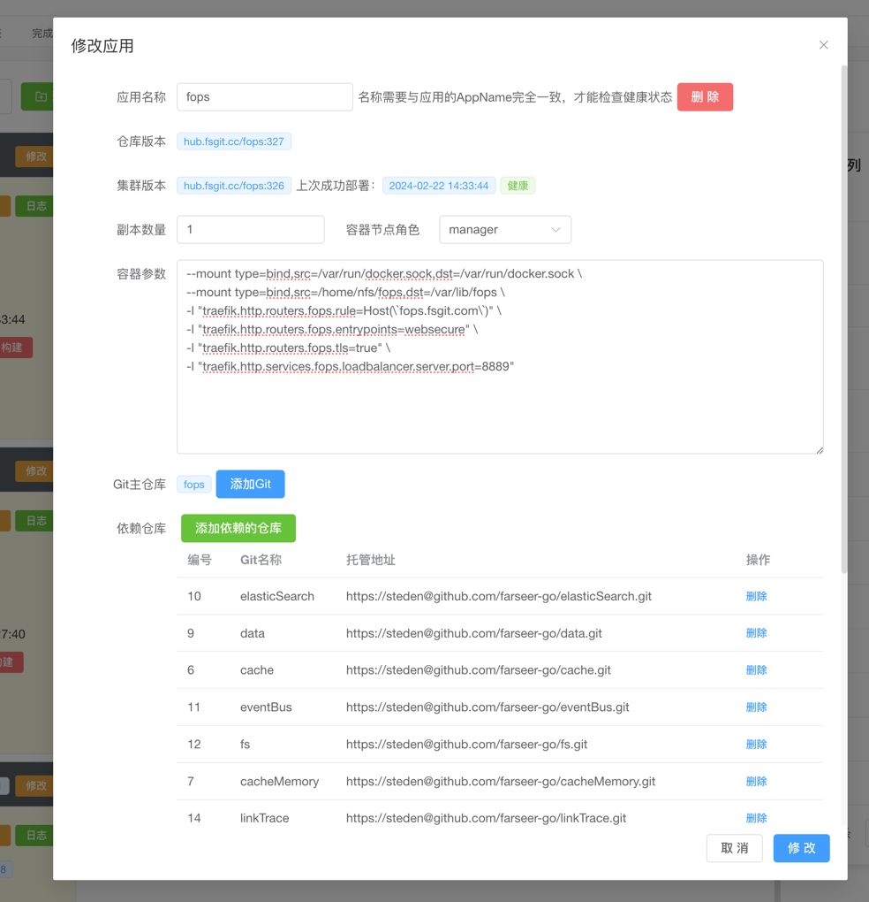
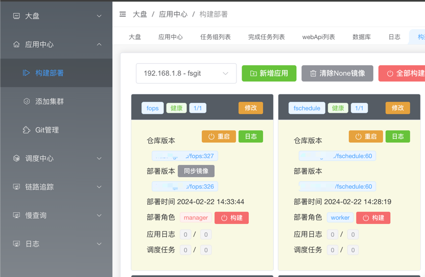
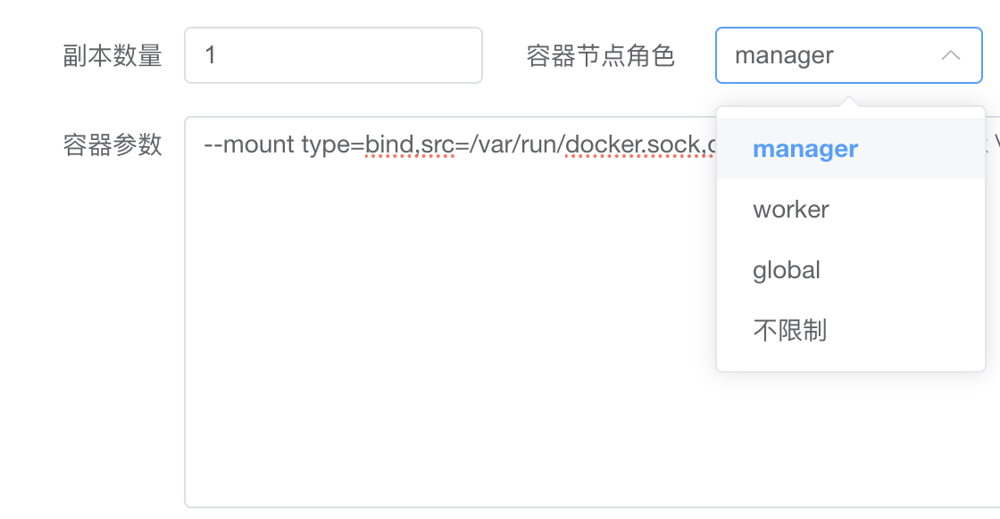

# 1、监控部署平台介绍
fops是一款包含：Docker集群管理、自动化部署、调度中心管理（FSchedule2.x)、日志采集、链路追踪、健康检查一体的小型轻量平台

基于docker环境进行部署和管理，通过简单的button click快速发布您的应用和监控应用的健康状态。

# 2、功能
* 集群管理：实时检查集群所有节点（或非节点主机）的健康状态。
* 监控预警：满足预警条件后，将告警信息触达到目地的。（如钉钉、邮件等）
* 远程终端：提供简易的linux web ssh。
* 应用部署：将Git仓库的代码、编译打包成docker镜像并发布到DockerSwarm集群（本地或远程集群）。
* 自动构建：支持应用有新的提交时，执行指定工作流。（如自动化执行UT、本地自动部署）
* 健康状态：实时检测应用的运行状态、启动、停止事件。
* 日志采集：实时查询Docker日志，以及通过farseer-go框架接入的应用，提供更精准的日志查询。
* 调度中心：提供FSchedule2.0的任务管理、监控、日志的Dashboard。
* 链路追踪：通过farseer-go框架接入的链路追踪，提供数据查询。
* 慢查询：支持db、Redis、http、es、mq 详细调用报告。
* 配置中心：提供应用的配置管理（应用可通过FOPS拉取配置信息）
* 访问统计：提供各个链路的性能统计


# 3、自动化部署
## 3.1 在fops中心新建你的应用，并配置好git仓库


## 3.2 配置工作流文件
工作流文件默认在应用仓库的根目录：`.fops/workflows/build.yml`,其脚本如：
```yaml
name: build
fopsName:                       # 【选填】设置后，该工作流文件只对在fops中应用名称为指定名称的才显示，默认不填便可
jobs:
  build:
    runs-on: steden88/cicd:3.0      # 工作流运行的容器镜像
    proxy: "192.168.1.123:7890"     # 【选填】配置工作环境的代理
    with:                           # 【选填】全局参数
      a: "可用于steps内，如{{a}}"
    env:
      GO111MODULE: on               # 【选填】配置构建容器环境变量
      GOPROXY: https://goproxy.cn   # 【选填】配置构建容器环境变量
      
    steps:
      - name: 开启Git代理            # 【选填】解决github仓库无法拉取
        uses: gitProxy@v1           # 内置组件名称
        with:
          proxy: "socks5://192.168.1.123:7890" # 代理地址

      - name: 拉取应用Git
        uses: checkout@v1 # 在fops配置了依赖时，将自动拉取所有依赖Git
        with:
          branch: main    # 【选填】支持不同工作流，切换到不同分支

#      - name: 拉取框架fs
#        uses: checkout@v1
#        with:            # 【选填】 也可以同时拉取指定的其他框架
#          gitHub: https://github.com/farseer-go/fs.git
#          gitBranch: main
#          gitUserName: test
#          gitUserPwd: 123456
#          gitPath: farseer-go/fs # 本地存储的位置

      - name: 安装go                # 【选填】针对go应用，内置安装go环境用于编译
        uses: setup-go@v1
        with:
          goVersion: go1.22.5
          goDownload:               # 【选填】也可以指定go sdk的下载地址

      - name: 编译
        run:                        # 指定运行的脚本
          - rm -rf ./go.work
          - go work init ./
          - go work edit -replace github.com/farseer-go/fs=../farseer-go/fs
          - go mod download
          - GOOS=linux GOARCH=amd64 CGO_ENABLED=0 go build -o ./fops -ldflags="-w -s" .

      - name: 安装npm                 # 【选填】针对vue应用，内置安装npm环境
        uses: setup-npm@v1

      - name: 编译前端
        run:                        # 指定运行的脚本
          - mkdir wwwroot
          - cd ./wwwsrc
          - npm install
          - npm run build
          - cp -r dist/* ../wwwroot/

      - name: 打包镜像
        uses: dockerBuild@v1         # 执行docker build命令。Dockerfile文件在添加应用时配置

      - name: 上传镜像                # 在集群中配置docker hub的地址（可私有仓库）
        uses: dockerPush@v1

      - name: 更新镜像                # 更新到现有集群中（也可以更新到远程集群，如生产环境）
        uses: dockerswarmUpdateVer@v1
```

## 3.3 jobs.build.runs-on = steden88/cicd:3.0-npm
fops在构建时会启动jobs.build.runs-on指定的镜像，后续构建步骤将在该环境中执行。

目前fops官方提供：steden88/cicd:3.0-npm镜像。该镜像基于alpine:latest，在其中安装了git、docker等基础工具

## 3.4 jobs.build.steps
为定义的构建步骤，根据该顺序逐个执行。

- jobs.build.steps.name：自定义的步骤名称
- jobs.build.steps.uses：使用的action名称，规则为：名称@版本。也可自定义实现action。
- jobs.build.steps.with：定义参数，参数由action要求定义
- jobs.build.steps.run：运行shell脚本

## 3.5 Action
fops目前为大家提供了8个常用的action程序：[点这里查看](https://github.com/farseers/FOPS-Actions/releases)

## 3.5.1 gitProxy: git代理
配置通过代理来拉取git仓库时，因为我们经常github无法访问。则可用这个action。 需要你自己提供proxy

## 3.5.2 checkout: 拉取git
如果你在fops中定义了依赖仓库，则会同时把这些依赖仓库一同拉取下来。

同时，如果你需要拉取未配置在fops的git。可通过with参数来指定仓库地址，如：
```yaml
      - name: 拉取框架fs
        uses: checkout@v1
        with:
          gitHub: https://github.com/farseer-go/fs.git
          gitBranch: main
          gitUserName: test
          gitUserPwd: 123456
          gitPath: farseer-go/fs
```
如果你需要拉取多个，则定义多次该action即可。

gitPath用于你希望存储到本地相对路径下的哪个目录。用于后续打包时使用。

## 3.5.4 setup-go：安装go
```yaml
      - name: 安装go
        uses: setup-go@v1
        with:
          goVersion: go1.22.5 #指定版本
          goDownload: # 自定义下载链接，可不填
```

## 3.5.5 run：运行shell
通过run配置，可自定义要执行的shell脚本，
```yaml
      - name: 编译
        run:
          - rm -rf ./go.work
          - go mod download
          - GOOS=linux GOARCH=amd64 CGO_ENABLED=0 go build -o ./fops -ldflags="-w -s" .
```

## 3.5.6 setup-npm：安装npm
也可搭配run，在执行完setup-npm后，运行run定义的shell脚本
```yaml
      - name: 安装npm
        uses: setup-npm@v1
        run: # 安装cnpm
          - npm install -g cnpm --registry=https://registry.npmmirror.com/
```
## 3.5.7 dockerBuild：打包镜像
将根据集群中定义的docker配置，对编译完的程序进行打包。
> 默认情况下，Dockerfile文件定义在应用的仓库根目录中
> 如需更改路径，请到应用中心修改
```yaml
      - name: 打包镜像
        uses: dockerBuild@v1
```

## 3.5.8 dockerPush：上传镜像
上传到集群定义的镜像hub，将在镜像打包成功后上传。
> 可以配置docker官网hub或私有hub，配置请到集群中修改
```yaml
      - name: 上传镜像
        uses: dockerPush@v1
```

## 3.5.9 dockerswarmUpdateVer：更新镜像
将镜像部署到当前集群
```yaml
      - name: 更新镜像
        uses: dockerswarmUpdateVer@v1
```

如果需要更新到远程集群，可以使用remoteClusterId参数：
```yaml
      - name: 更新镜像
        uses: dockerswarmUpdateVer@v1
        with:
          remoteClusterId: 1
```
fops是如何知道远程集群的地址，这需要在远程集群中安装好fops。同时在本地的集群配置中设置好远程fops地址。


## 4 容器角色

角色主要是为了应用在集群中运行时，部署的位置限制。
- `manager`：只运行到master节点
- `worker`：只运行到非master节点
- `global`：所有节点都会运行一个实例。
- `不限制`：任意节点都可以运行

## 5 监控集群节点、主机基础资源信息
通过在所有主机上安装`FOPS-Agent`，来监控所有主机和集群节点。
## 6 监控容器事件

## 7 健康告警
可对主机节点、容器应用的基础指标作告警通知，支持的指标有：
- `cpu`：如cpu > 200，告警通知
- 内存`memory`：如memory > 80，告警通知（80为百分比）
- 硬盘`disk`：如disk > 80，告警通知（80为百分比）
- 实例`instances`：如instances = false，告警通知
- 节点状态`pcStatus`：如pcStatus <> Ready，告警通知
- 节点状态`nodeAvailability`：如nodeAvailability <> Active，告警通知

> 自定义，go应用可通过依赖`monitor`组件上传业务指标。通过fops的通知规则来，告警通知