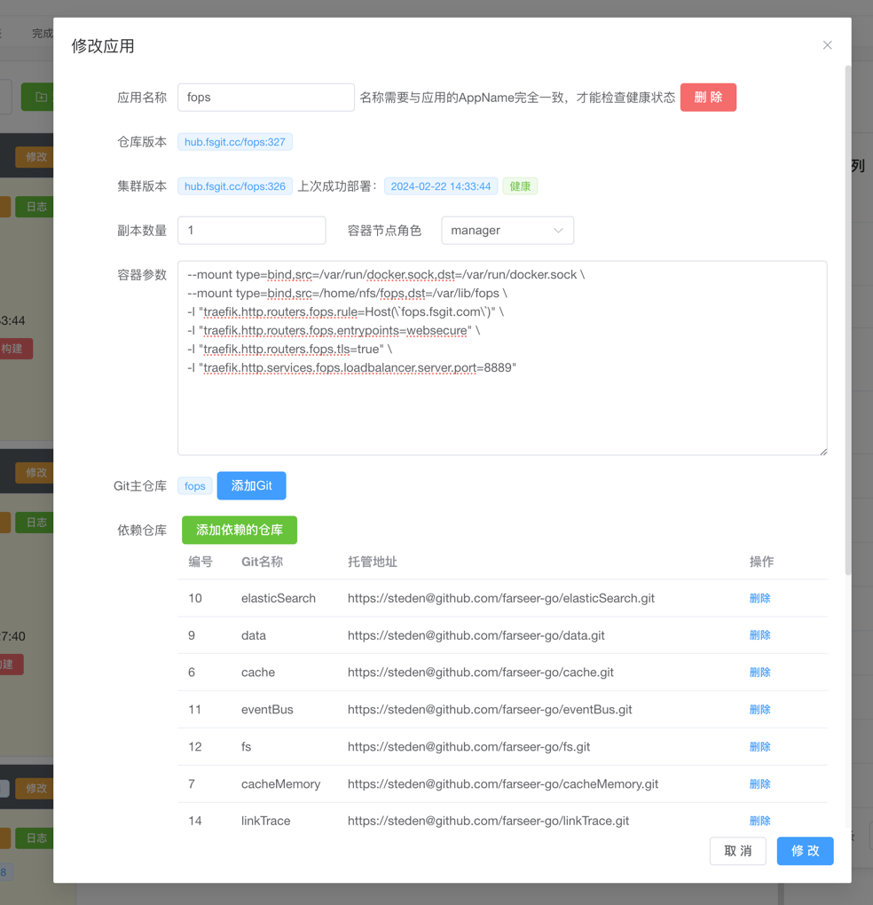
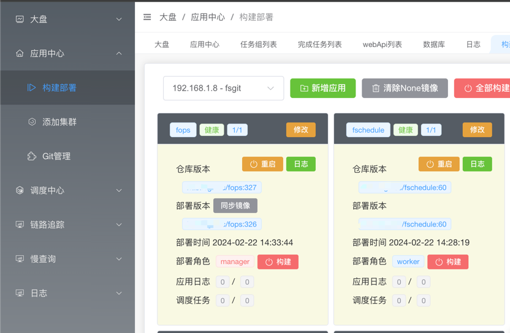

# 1、监控部署平台介绍
fops是一款集自动化部署、调度中心管理（FSchedule2.x)、日志采集、链路日志、健康检查、告警通知一体的Web管理平台

基于docker环境进行部署和管理，通过简单的button click快速发布您的应用和监控应用的健康状态。

# 2、功能
* 自动化部署：从git仓库拉取代码、编译打包成docker镜像并发布到集群中。
* 调度中心管理：提供FSchedule2.0的任务管理。
* 链路日志：通过farseer-go框架接入的链路追踪，提供数据查询。
* 日志采集：采集docker中的所有日志，统一查询。
* 慢查询：支持db、Redis、http、es、mq 耗时高的查询。
* 服务器管理：自动收集服务器节点的信息、CPU、内存、磁盘使用情况。
* 应用管理：检查应用的健康状态，及告警通知。

# 3、自动化部署
## 3.1 在fops中心新建你的应用，并配置好git仓库


## 3.2 配置工作流文件
工作流文件默认在应用的根目录：`.fops/workflows/build.yml`,如：
```yaml
name: build
jobs:
  build:
    runs-on: steden88/cicd:2.0      # 工作流运行的容器镜像
    proxy: "192.168.1.123:7890"     # 配置工作环境的代理
    with:                           # 全局参数
      a: "可用于steps内，如{{a}}"
    env:
      GO111MODULE: on               # 配置构建容器环境变量
      GOPROXY: https://goproxy.cn   # 配置构建容器环境变量
      
    steps:
      - name: 开启Git代理
        uses: gitProxy@v1
        with:
          proxy: "socks5://192.168.1.123:7890"

      - name: 拉取应用Git
        uses: checkout@v1 # 在fops配置了依赖时，将自动拉取所有依赖Git

#      - name: 拉取框架fs
#        uses: checkout@v1
#        with:
#          gitHub: https://github.com/farseer-go/fs.git
#          gitBranch: main
#          gitUserName: test
#          gitUserPwd: 123456
#          gitPath: farseer-go/fs

      - name: 安装go
        uses: setup-go@v1
        with:
          goVersion: go1.22.0
          goDownload:

      - name: 编译
        run:
          - rm -rf ./go.work
          - go work init ./
          - go work edit -replace github.com/farseer-go/fs=../farseer-go/fs
          - go mod download
          - GOOS=linux GOARCH=amd64 CGO_ENABLED=0 go build -o ./app-server -ldflags="-w -s" .

      - name: 安装npm
        uses: setup-npm@v1

      - name: 编译前端
        run:
          - mkdir wwwroot
          - cd ./wwwsrc
          - npm install
          - npm run build
          - cp -r dist/* ../wwwroot/

      - name: 打包镜像
        uses: dockerBuild@v1

      - name: 上传镜像
        uses: dockerPush@v1

      - name: 更新镜像
        uses: dockerswarmUpdateVer@v1
```

## 3.3 jobs.build.runs-on = steden88/cicd:2.0
fops在构建时会启动jobs.build.runs-on指定的镜像，后续构建步骤将在该环境中执行。

目前fops官方提供：steden88/cicd:2.0镜像。该镜像基于alpine:latest，在其中安装了git、docker等基础工具

## 3.4 jobs.build.steps
为定义的构建步骤，根据该顺序逐个执行。

- jobs.build.steps.name：自定义的步骤名称
- jobs.build.steps.uses：使用的action名称，规则为：名称@版本。也可自定义实现action。
- jobs.build.steps.with：定义参数，参数由action要求定义
- jobs.build.steps.run：运行shell脚本

## 3.5 Action
fops目前为大家提供了8个常用的action程序：[点这里查看](https://github.com/farseers/FOPS-Actions/releases)

## 3.5.1 gitProxy: git代理
配置通过代理来拉取git仓库时，因为我们经常github无法访问。则可用这个action。 需要你自己提供proxy

## 3.5.2 checkout: 拉取git
如果你在fops中定义了依赖仓库，则会同时把这些依赖仓库一同拉取下来。

同时，如果你需要拉取未配置在fops的git。可通过with参数来指定仓库地址，如：
```yaml
      - name: 拉取框架fs
        uses: checkout@v1
        with:
          gitHub: https://github.com/farseer-go/fs.git
          gitBranch: main
          gitUserName: test
          gitUserPwd: 123456
          gitPath: farseer-go/fs
```
如果你需要拉取多个，则定义多次该action即可。

gitPath用于你希望存储到本地相对路径下的哪个目录。用于后续打包时使用。

## 3.5.3 dockerPush：上传镜像
上传到集群定义的hub，则不用添加任何参数：
```yaml
      - name: 上传镜像
        uses: dockerPush@v1
```
期望将镜像传到其它（或多次上传不同docker hub)时，可自定义要上传镜像仓库
```yaml
      - name: 上传镜像
        uses: dockerPush@v1
        with:
          dockerImage: xxx:{{appName}}.{{buildNumber}}
          dockerHub:
          dockerUserName: username
          dockerUserPwd: "token"
```
同时，如果希望远程更新线上的fops服务。可使用如下参数：
```yaml
      - name: 上传镜像
        uses: dockerPush@v1
        with:
          dockerImage: xxx:{{appName}}.{{buildNumber}}
          dockerHub:
          dockerUserName: username
          dockerUserPwd: "token"
          fopsAddr: https://fops.xxx.com   # 通知要更新的远程fops地址
          fopsClusterId: 1                 # 远程fops的集群ID，设置后就立即部署。否则仅更新仓库版本
```